# JevFuzz

**Find the input that changes the decision. Shrink it. Keep it.**

JevFuzz finds small input changes that break your Jev decision contracts.
Confirm the violation with new calls, shrink the counterexample, and keep it as a regression test.



An actual Cloudflare Jev finding, confirmed with 24 new calls after shrinking.
The input is synthetic; the API results are real. [Evidence and SVG source](docs/readme-demo.md).

## Start

Run in your repository with [GitHub Actions](docs/github-actions.md):

```yaml
- uses: yottayoshida/jevfuzz@2b29d83f99814dc95644646b7721f5d12dd25695
  with:
    command: fuzz
    target: .jevfuzz/campaign.json
    provider: cloudflare
  env:
    CLOUDFLARE_ACCOUNT_ID: ${{ secrets.CLOUDFLARE_ACCOUNT_ID }}
    CLOUDFLARE_API_TOKEN: ${{ secrets.CLOUDFLARE_API_TOKEN }}
```

Copy the [campaign](examples/github-actions/campaign.json) and
[complete workflow](examples/github-actions/jevfuzz.yml) to get started.
TypeSafe is supported with `TYPESAFE_API_KEY`. [CLI setup](docs/github-actions.md#cli-setup).

## Keep a counterexample

```sh
jevfuzz shrink finding.json --out smaller.json
jevfuzz corpus add smaller.json --corpus .jevfuzz/corpus
jevfuzz corpus triage .jevfuzz/corpus <id> --status accepted_regression --actor me --reason "Reviewed relation"
jevfuzz check .jevfuzz/corpus
jevfuzz report smaller.json --format html --out smaller.html
```

Supports Choice, Noul, Score, and production policies. Uniform search is the
default; [feedback benchmarks](docs/benchmark-feedback-v4-results.md) and v1 compatibility are documented.

A FAIL breaks a declared relation; it does not establish factual correctness.
Your run artifacts stay local by default and contain inputs and responses. No telemetry.
The bundled demo uses the public synthetic evidence linked above.

[CLI and migration](docs/v09-migration.md) ·
[Provider evidence](docs/provider-conformance.md) ·
[Implementation status](docs/v09-implementation.md) · [MIT](LICENSE)

Current CLI release: **v0.2.0**. The action is available at the pinned commit above.
